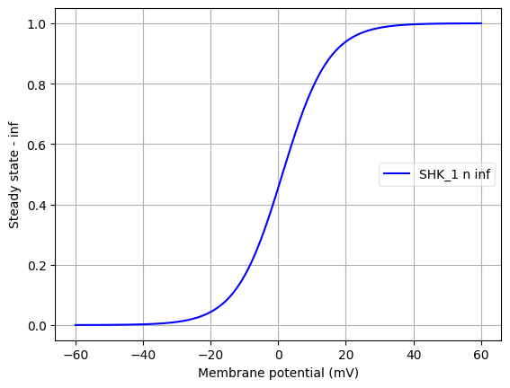
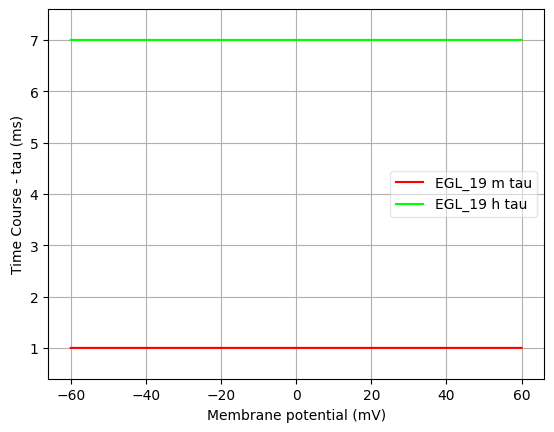

Channel information
===================

Channel information at: T = 34.0 degC, E_rev = 40.0 mV, [Ca2+] = 0.001 mM

<h2>SHK_1</h2>

Ion: <b>k</b> |
Conductance expression: <b>g = gmax * n4 </b> |
NeuroML2 file: <a href="../SHK_1.channel.nml">SHK_1.channel.nml</a>

Notes
SHK_1 channel from Johnson and Mailler, BICOB 2015

<h2>EGL_19</h2>

Ion: <b>ca</b> |
Conductance expression: <b>g = gmax * m2 * h </b> |
NeuroML2 file: <a href="../EGL_19.channel.nml">EGL_19.channel.nml</a>

Notes
EGL_19 channel from Johnson and Mailler, BICOB 2015

